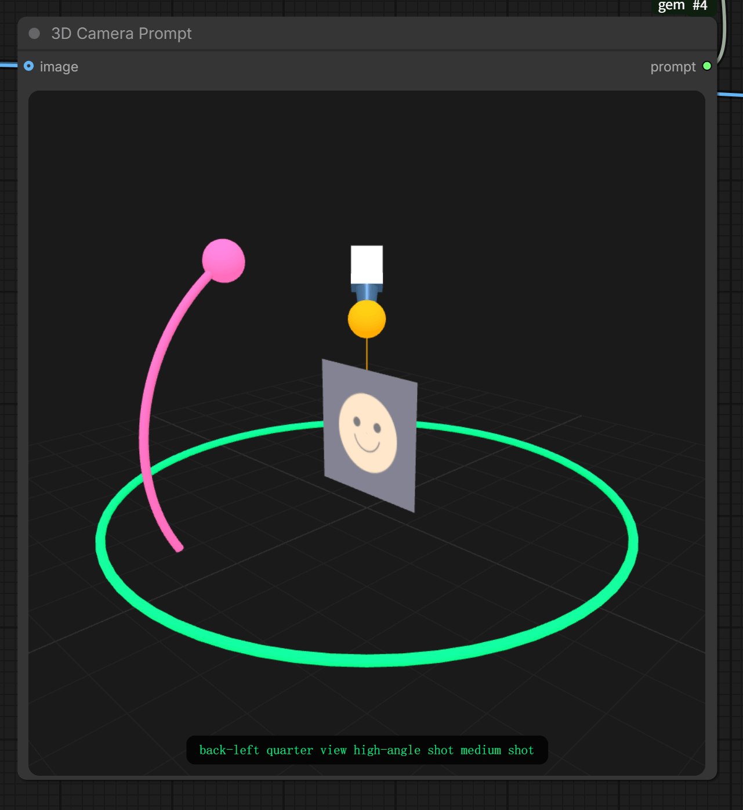

# Gemini 3 Custom Nodes for ComfyUI

Lightweight ComfyUI nodes for Gemini 3 preview models, plus a seed helper and a 3D camera prompt widget.

适用于 Gemini 3 预览模型的轻量 ComfyUI 节点，包含种子辅助节点与 3D 相机提示词控件。

## Features / 功能
- Text + multimodal prompting for `gemini-3-pro-preview`.
- Image generation for `gemini-3-pro-image-preview` with aspect ratio and size controls.
- Seed helper to normalize any value into Gemini's signed int32 range.
- 3D camera prompt widget with snapping camera angles and optional background image.


- 支持 `gemini-3-pro-preview` 的文本/多模态输入。
- 支持 `gemini-3-pro-image-preview` 的图像生成（比例与尺寸可控）。
- Seed 辅助节点将任意数值归一到 Gemini 的 int32 范围。
- 3D 相机提示词控件（角度自动吸附，可显示输入图像）。

## Quick Start / 快速开始
1) Install dependencies:
```
pip install -r requirements.txt
```
2) Copy `config.example.json` to `config.json` and fill in your API key(s).
3) Restart ComfyUI.

1) 安装依赖：
```
pip install -r requirements.txt
```
2) 将 `config.example.json` 复制为 `config.json` 并填写 API key。
3) 重启 ComfyUI。

## API Keys / API 密钥
- Preferred: put keys in `config.json` (ignored by git).
- Fallback: set `GEMINI_API_KEY` in your environment.
- Node input `api_key` can override. When quota/limit errors occur, the node automatically tries the next key.

- 推荐：在 `config.json` 里配置（不会提交到 Git）。
- 备用：设置环境变量 `GEMINI_API_KEY`。
- 节点输入的 `api_key` 可覆盖配置。遇到额度/限流错误时会自动轮换下一枚 key。

## Nodes / 节点说明

### Gemini 3 Pro (Text)
- **Model**: `gemini-3-pro-preview`
- **Inputs**: `prompt`, optional `image_1`...`image_10`, `media_resolution`, `thinking_level`, `seed`
- **Outputs**: `text`

文本/多模态节点，支持最多 10 张图像输入，返回文本结果。

### Gemini 3 Pro Image
- **Model**: `gemini-3-pro-image-preview`
- **Inputs**: `prompt`, optional `reference_image`...`reference_image_10`, `aspect_ratio`, `image_size`, `seed`
- **Outputs**: `image` + `text`

图像生成节点，支持参考图像、比例与尺寸控制，返回图像和模型文本。

### Gemini Seed (int32)
- **Inputs**: `seed`, `mode` (`random_if_negative`, `wrap`, `clamp`)
- **Outputs**: normalized `seed`

Seed 归一化节点，适用于任何来源的种子数值。

### 3D Camera Prompt
- **Inputs**: `azimuth`, `elevation`, `distance`, optional `image`
- **Outputs**: `prompt`

3D 相机提示词控件，输出相机角度对应的 prompt，可显示输入图像。

## 3D Camera Prompt Details / 3D 相机参数
- **azimuth**: horizontal rotation (0° front, 90° right, 180° back, 270° left). Snaps to 8 angles.
- **elevation**: vertical tilt (-30° low, 0° eye-level, 60° high). Snaps to 4 heights.
- **distance**: camera distance (0.6 close, 1.0 medium, 1.8 wide). Snaps to 3 distance levels.

- **azimuth**：水平旋转角（0°=正面，90°=右侧，180°=背面，270°=左侧）。自动吸附到 8 个视角。
- **elevation**：垂直仰俯角（-30°=低机位，0°=平视，60°=高机位）。自动吸附到 4 个高度。
- **distance**：镜头远近（0.6=近景，1.0=中景，1.8=远景）。自动吸附到 3 个距离档位。

## Seed Behavior / Seed 规则
- `seed = -1` generates a new random seed each run.
- Valid range: `0` to `2147483647` (Gemini expects signed int32).
- `Gemini Seed (int32)` modes:
  - `random_if_negative`: negative becomes random; otherwise wrapped.
  - `wrap`: always wrap into range.
  - `clamp`: out-of-range values are clamped.

- `seed = -1` 每次运行都会随机生成新种子。
- 合法范围：`0` 到 `2147483647`（Gemini 要求有符号 int32）。
- `Gemini Seed (int32)` 模式：
  - `random_if_negative`：负数变随机，否则取模。
  - `wrap`：始终取模到合法范围。
  - `clamp`：超出范围则截断到边界。

## Notes / 说明
- Images are sent as PNG and returned as standard ComfyUI `IMAGE`.
- The image node returns both the generated image and any model text.
- `aspect_ratio=auto` picks the closest ratio based on the first valid reference image.

- 图像请求会自动转为 PNG，输出为 ComfyUI 标准 `IMAGE`。
- 图像节点会返回生成图像与模型文本。
- `aspect_ratio=auto` 会根据第一张有效参考图像选择最接近的比例。

The original project was inspired by:
https://huggingface.co/spaces/multimodalart/qwen-image-multiple-angles-3d-camera
